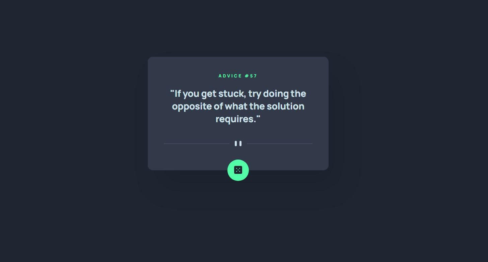

# Frontend Mentor - Advice generator app solution

This is a solution to the [Advice generator app challenge on Frontend Mentor](https://www.frontendmentor.io/challenges/advice-generator-app-QdUG-13db). Frontend Mentor challenges help you improve your coding skills by building realistic projects.

## Table of contents

- [Overview](#overview)
  - [The challenge](#the-challenge)
  - [Screenshot](#screenshot)
  - [Links](#links)
- [My process](#my-process)
  - [Built with](#built-with)
  - [What I learned](#what-i-learned)
  - [Continued development](#continued-development)
- [Author](#author)

## Overview

Another Frontend Mentor Challenge. This one required getting advice from an API with a simplistic UI. Pretty straight forward. I ended up adding a few extra items like a spinner between calls to give a smoother UX.

### The challenge

Users should be able to:

- View the optimal layout for the app depending on their device's screen size
- See hover states for all interactive elements on the page
- Generate a new piece of advice by clicking the dice icon

### Screenshot

### Links

- Solution URL: [https://github.com/jmmarketing/advice-generator-FEM](https://github.com/jmmarketing/advice-generator-FEM)
- Live Site URL: [https://jmmarketing.github.io/advice-generator-FEM/](https://jmmarketing.github.io/advice-generator-FEM/)

## My process

- Open Figma, Style Guide, and direction documentatio; take the time needed to digest the project. Start ideating on basic layout, naming conventions, JS design pattern.
- Create file and folder structure based on initial ideation above.
- HTML structure with BEM naming conventions.
- Buildout of SCSS variables from Figma presets/variables.
- Basic desktop styling first.
- Build mixins for responsive breakpoints (from Figma docs or by "guess and testing").
- "Not-desktop" styling.
- Start build out of Javascript using single file monolith to working condition.
- Psuedo-organizing notes on which JS items need to go into Model, View, Controller.
- Refacforting of JS into respected files.
- Start DRYing up JS code.
- Make edits to HTML, CSS, and JS to make a little cleaner.
- QA / Test
- Hit point of Good enough. Just kidding. Looks great/works good. Submit for review.

### Built with

- Semantic HTML5 markup
- CSS custom properties
- Flexbox
- Desktop-first workflow
- [Parcel](https://parceljs.org/) - Compiler
- [Advice Slip API](https://api.adviceslip.com) - Advice API
- [Pure CSS Loaders](https://github.com/db1996/Pure-CSS-loaders) - SVG Spinners

### What I learned

Used this to continue practcing the MVC design pattern and API (fetch) calls. This build was much simpler than the [Age Calculator](https://github.com/jmmarketing/age-calculator-FEM), so getting everything set up correctly felt like a much smoother build out.

I was able to play around with SVG spinners and customizing them to fit the design of this project. Definitely need to get more acquainted to be able to comfortably use, create, in my own projects.

### Continued development

Will continue using SVGs in projects where appropriate, as well keeping with becoming proficient/advanced in MVC design, SCSS, and using more Error handling when working with APIs.

## Author

- Website - [Jeff McLean](https://www.jeffreymclean.com)
- Frontend Mentor - [@jmmarketing](https://www.frontendmentor.io/profile/jmmarketing)
- Twitter - [@jeffe_mclean](https://www.twitter.com/jeffe_mclean)
